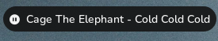
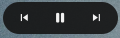
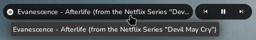

# 🎧 Waymedia
Waymedia is a custom waybar script that checks the current active player and shows it. 
I felt the need to create one because most media scripts only show the first item and not the active one.

# 📷 Showcase
Waymedia



Buttons



Tooltip



# ✨ Features
- Shows active player
- Limit the text length
- Change playing/pause icons
- Change next/previous icons (Only on buttons script)
- Change the divider

# 🖥️ Installation
To install you can clone the repository into your scripts folder in the waybar config.
```sh
mkdir -p ~/.config/waybar/scripts/waymedia
git clone https://github.com/lighttigerXIV/waymedia.git ~/.config/waybar/scripts/waymedia
```

# ⚙️ Configuration
First, add `"custom/waymedia"` or `"custom/waymedia-buttons"` inside you module in waybar `config.json`.

## Waymedia
Add the required configuration.
> [!NOTE]
> This requires a key "formatting" because it can crash if in "format" key.
```json
"custom/waymedia": {
  "format": "{}",
  "formatting": "{icon}{artist}{divider}{title}",
  "exec": "~/.config/waybar/scripts/waymedia/waymedia",
  "return-type": "json",
  "interval": 1,
  "on-click": "playerctl play-pause",
  "on-scroll-up": "playerctl next",
  "on-scroll-down": "playerctl previous"
}
```

You can also change the icons and text length
```json
"pause-icon": "   ",
"play-icon": "   ",
"divider": " - ",
"limit": 60
```

## Waymedia Buttons
Add the required configuration.
```json
"custom/waymedia-buttons": {
  "format": "{}",
  "exec": "~/.config/waybar/scripts/waymedia/waymedia-buttons",
  "return-type": "json",
  "interval": 1,
  "on-click": "playerctl play-pause",
  "on-scroll-up": "playerctl next",
  "on-scroll-down": "playerctl previous"
}
```

You can also change the icons
```json
  "pause-icon": "   ",
  "play-icon": "   ",
  "previous-icon": " 󰒮 ",
  "skip-icon": " 󰒭 ",
  "empty-message": "  Nothing Playing"
```
